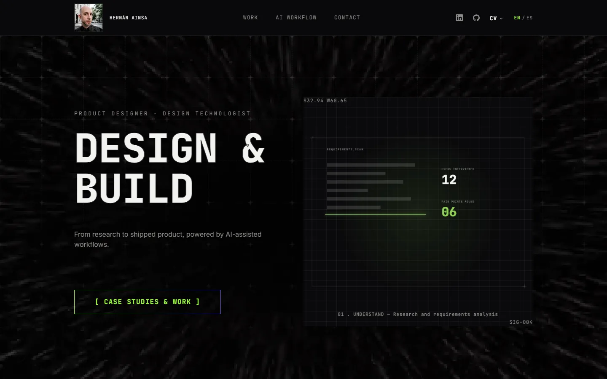
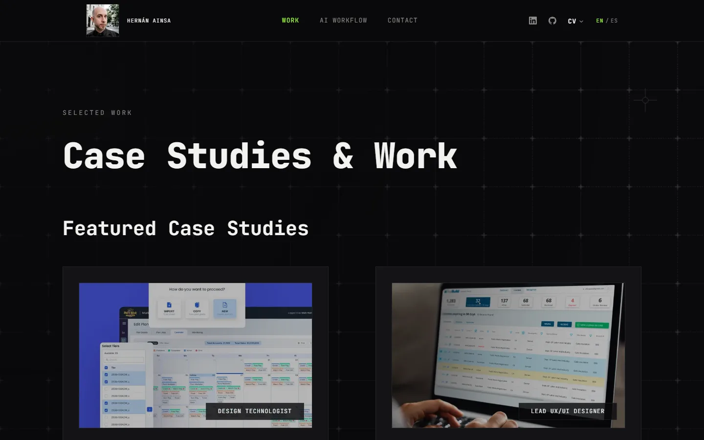
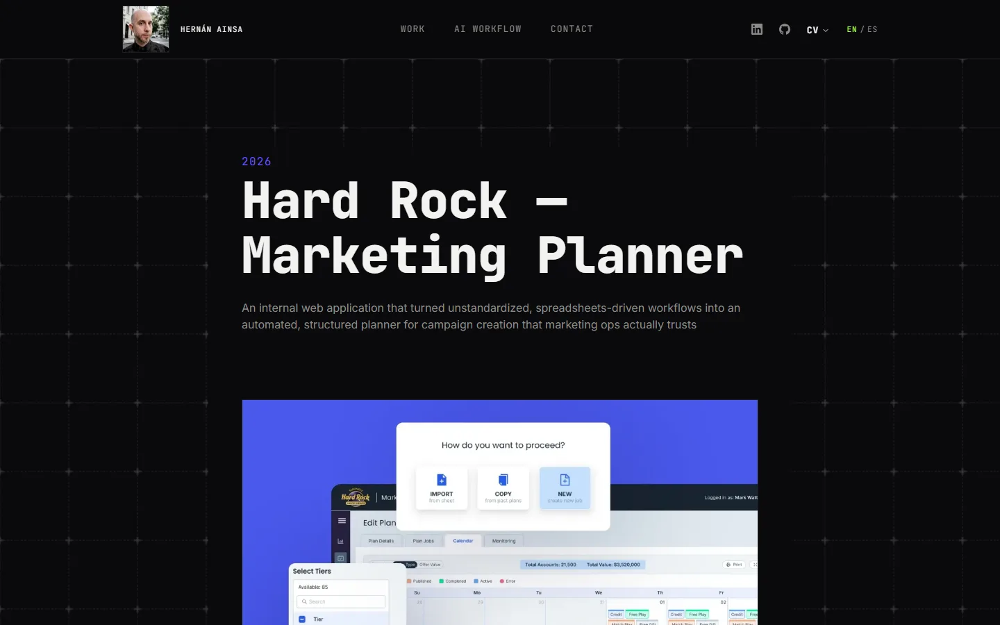

# Hernán Ainsa — Portfolio

Personal portfolio of Hernán Ainsa — UX/UI designer and front-end developer —
rebuilt from a static Webflow site into a Next.js application.

It is meant to work as two things at once: a portfolio that presents the work,
and a readable example of how it was built. The reasoning behind every
technical choice lives in [`docs/`](docs/), not just in the commit history.

**Live:** <https://hernan-ainsa.vercel.app>



<table>
<tr>
<td width="50%"></td>
<td width="50%"></td>
</tr>
</table>

## Highlights

- **Bilingual by construction (ES/EN).** Locale-prefixed routes via
  `next-intl`, with every route and component shipping both languages in the
  same commit that introduces it.
- **File-based content, no CMS.** Case studies are MDX plus a typed metadata
  module per project, validated with Zod at build time — see
  [docs/CONTENT_MODEL.md](docs/CONTENT_MODEL.md).
- **Design system as tokens.** Zero border-radius, dark palette, mono for
  technical text and sans for prose, all driven by Tailwind v4 theme tokens —
  see [docs/DESIGN_SYSTEM.md](docs/DESIGN_SYSTEM.md).
- **A 3D hero that degrades gracefully.** A react-three-fiber wireframe sphere
  with a static fallback for no-WebGL and reduced-motion users.
- **Accessibility treated as a test, not a checklist.** `jest-axe` assertions
  run alongside the component tests.
- **No backend.** The contact form posts to FormSubmit; everything else is
  static or server-rendered from files in this repo.

## Stack

| Area        | Choice                                            |
| ----------- | ------------------------------------------------- |
| Framework   | Next.js 16 (App Router, React 19, React Compiler) |
| Language    | TypeScript (strict)                               |
| Styling     | Tailwind CSS v4                                   |
| i18n        | next-intl                                         |
| Content     | MDX (`next-mdx-remote`) + Zod schemas             |
| 3D / motion | react-three-fiber, drei, Motion                   |
| Forms       | react-hook-form + Zod                             |
| Testing     | Vitest, React Testing Library, jest-axe           |
| Analytics   | Vercel Analytics                                  |
| Hosting     | Vercel                                            |

Full rationale for every choice, including what was deliberately left out:
[docs/ARCHITECTURE.md](docs/ARCHITECTURE.md).

## Local development

Requires Node >= 20.9 and pnpm.

```bash
pnpm install
```

```bash
pnpm dev
```

The site runs at http://localhost:3000 and redirects to the negotiated locale
(`/en` or `/es`).

### Other commands

```bash
pnpm test        # Vitest suite (unit + composition + a11y)
pnpm lint        # ESLint, zero warnings tolerated
pnpm typecheck   # tsc --noEmit
pnpm build       # production build
pnpm img:webp    # convert screenshots under public/images to WebP
```

Commits are checked by commitlint (Conventional Commits) and staged files are
run through ESLint and Prettier via a Husky pre-commit hook.

### Environment

| Variable                       | Purpose                                                                                           |
| ------------------------------ | ------------------------------------------------------------------------------------------------- |
| `NEXT_PUBLIC_FORMSUBMIT_EMAIL` | Destination address for the contact form. Without it the form renders but submission is disabled. |

## Project structure

```
src/
  app/[locale]/     routes: /, /work, /work/[slug], /ai-workflow, /contact
  components/       UI primitives, layout, and per-section components
  content/work/     one folder per case study: en.mdx, es.mdx, index.ts
  i18n/messages/    en.json, es.json — all interface copy
  lib/              shared site config and links
public/images/work/ case study screenshots (WebP)
docs/               brief, architecture, design system, content model, plan
```

## Documentation

- [docs/PROJECT_BRIEF.md](docs/PROJECT_BRIEF.md) — original design brief and
  functional spec
- [docs/ARCHITECTURE.md](docs/ARCHITECTURE.md) — stack and rationale
- [docs/DESIGN_SYSTEM.md](docs/DESIGN_SYSTEM.md) — tokens and component specs
- [docs/CONTENT_MODEL.md](docs/CONTENT_MODEL.md) — case study content model
- [docs/IMPLEMENTATION_PLAN.md](docs/IMPLEMENTATION_PLAN.md) — phased build
  plan
- [docs/CODING_STANDARDS.md](docs/CODING_STANDARDS.md) — conventions

## License

Code is MIT licensed — see [LICENSE](LICENSE).

The written case studies, images, and CV files under `src/content/` and
`public/` are Hernán Ainsa's work and are not covered by that license.
